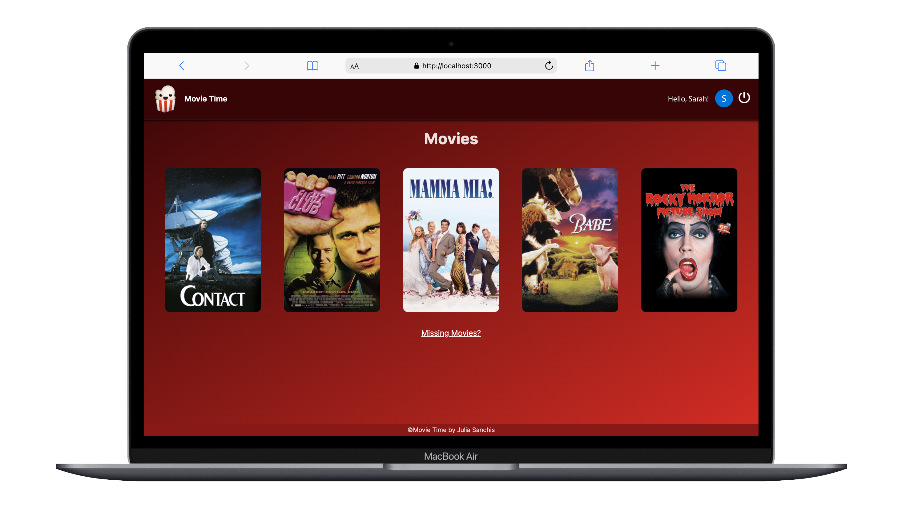

`#react` `#express` `#typescript` `#postgres` `#prisma` `#cloudinary` `#backend` `#assembler-institute-of-technology` `#master-in-software-engineering` `#node.js` `#next.js` `#zod` `#react-hook-form`

> DISCLAIMER: This repository has very few commits because it is a combination of two other projects (front and back) that I have worked on separately.

# Movie Time! 🍿

This is an application to keep track of the movies you are watching and rate them.

## Front end

### Next.JS

Next.js is a React framework for building full-stack web applications. We use React Components to build user interfaces, and Next.js for additional features and optimizations.

#### Installation

- npx create-next-app@latest
- Select a name for your project

#### Adding other tools

- Dotenv: npm i -D dotenv
- Zod: npm i zod
- React Hook Form: npm i react-hook-form and npm i @hookform/resolvers
- Auth0: npm i auth0/nextjs-auth0

## Back end

### Tools

[Node.js](https://nodejs.org/en)
[Express](https://expressjs.com)
[Mongoose](https://mongoosejs.com/docs/index.html)
[Postman](https://www.postman.com)
[MongoDB](https://www.mongodb.com/es)
[Prisma](https://www.prisma.io)
[PostgreSQL](https://www.postgresql.org)

### Installing tools

- npm init -y
- npm i express
- npm i -D typescript nodemon dotenv @types/express ts-node @types/node

### Preparing server with Nodemon

Nodemon is a tool that aids in the development of Node.js applications by automatically restarting the server whenever it detects changes in project files.

### Mongoose

- npm i mongoose

Mongoose provides a schema-based solution to model your application data.

The environment variables (.env) are variables that we do not want to upload to GitHub because they contain sensitive information.

We forget about PUT method, because PATCH method only changes the field you are interested in. It's an action that weighs much less. PUT changes everything.

### MongoDB

- Local: brew services start mongodb-commnity@7.0 / brew services stop mongodb-commnity@7.0 / mongosh
- Online: Cluster Atlas

### Migrating to Prisma 🔼

- npm i -D prisma
- npx prisma init
- npx prisma format
- npm i -D @prisma/client
- npx prisma generate (everytime we make changes at schema.prisma file)

Prisma does not create a test database by default, not like MongoDB! We have to specify the database name at the end of the server link!

### PostgreSQL 🐘

Run shell and introduce:

- Server
- DataBase
- Port
- User

### Migrating to PostgreSQL

- npx prisma migrate dev

### cloudinary

- npm i cloudinary
- npm i express-fileupload
- npm i -D @types/express-fileupload
- npm i fs-extra
- npm i -D @types/fs-extra
- npm i body-parser
