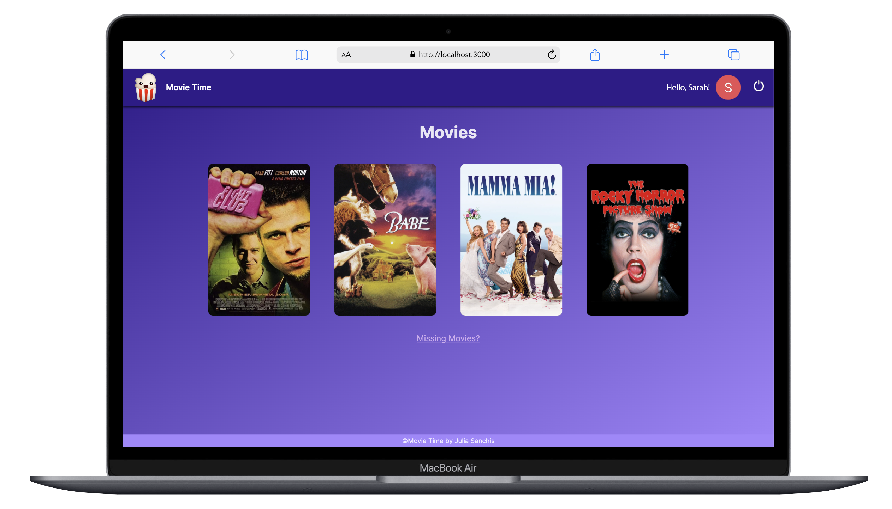

`#react` `#express` `#typescript` `#postgres` `#prisma` `#cloudinary` `#backend` `#assembler-institute-of-technology` `#master-in-software-engineering` `#node.js` `#next.js` `#zod` `#react-hook-form`

# Movie Time! 🍿

This is an application to keep track of the movies you are watching and rate them.

## Next.JS

Next.js is a React framework for building full-stack web applications. We use React Components to build user interfaces, and Next.js for additional features and optimizations.

### Installation

- npx create-next-app@latest
- Select a name for your project

### Adding other tools

- Dotenv: npm i -D dotenv
- Zod: npm i zod
- React Hook Form: npm i react-hook-form and npm i @hookform/resolvers
- Auth0: npm i auth0/nextjs-auth0
